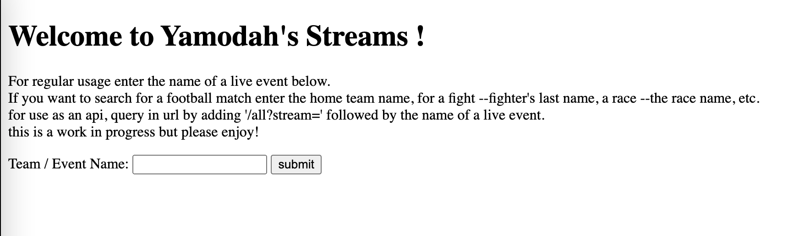
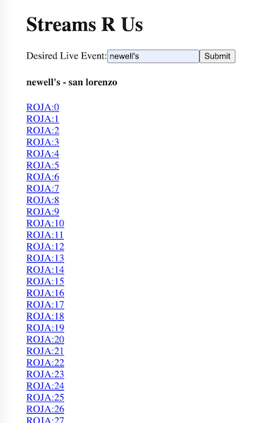

# Welcome to Yamodah Streams!

With the inlfux of big money TV deals, it has grown increasingly difficult to 
find sports all in one location. There is no $15 sports package you can add onto 
your cable subscription (if you even have cable at this point), rather one must subscribe
to countless online streams to catch their beloved live sporting events. 

I think this is unacceptable. Utilizing the kind a Go-Colly web scraper I have collected links
from 3 stream sites I have found to reliably have almost every live sporting event. 
These sites are great but their ads can be annoying to say the least and often times their proper URL's
cannot be found in a google search. This crawler and api serves to mitigate those two issues 
and provide a friendlier list of links. 

The API lives at https://yamodahstreams.herokuapp.com/ 

If you have a json reader extension on your broweser this should be sufficent. 

However, if you do not a frontend client lives at https://streamsrus.netlify.app/ with clickable links for your convenience. 

If you have any suggestions to imporve the webscrapping or overall experience please feel to reach out!

